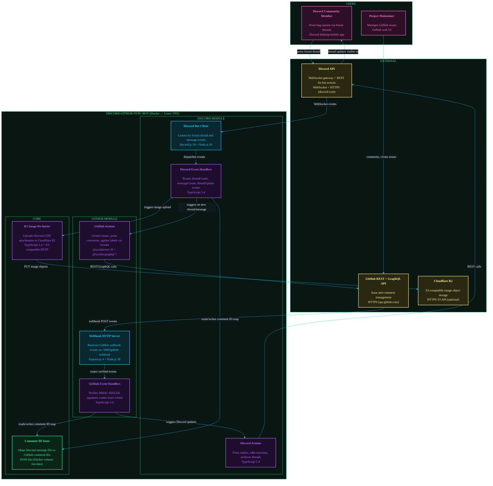

# Container Diagram: discord-github-sync-bot

## Diagram

## Coupling Notes

### Runtime Dependencies
- Discord Bot Client depends on Discord API (persistent WebSocket — bot restarts break connection)
- Webhook HTTP Server requires a public IP/domain for GitHub to POST events to
- Discord Handlers and GitHub Handlers both share the Comment ID Store (single-writer risk on concurrent events)
- GitHub Actions depends on GitHub API for all issue/comment operations (no local fallback)

### Build-time Dependencies
- All modules compiled together as a single TypeScript project (tsup) — no independent deployment of submodules

### Data Dependencies
- commentMap.json in Docker volume `bot-data` is the sole correlation between Discord thread IDs and GitHub issue/comment IDs — loss of this volume breaks bidirectional sync permanently for existing threads
