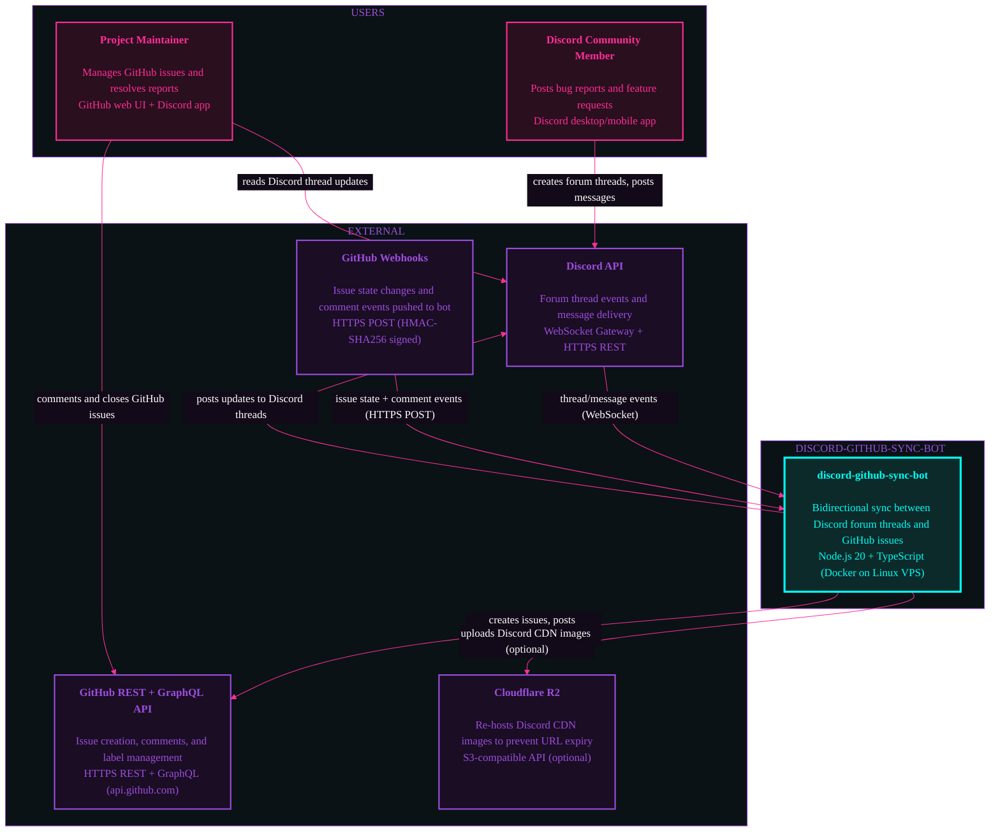

# System Context: discord-github-sync-bot

## Diagram

## Coupling Notes

### Runtime Dependencies
- Bot depends on Discord API (persistent WebSocket connection for event streaming)
- Bot depends on GitHub API (outbound HTTPS calls on every thread/message event)
- Bot depends on GitHub Webhooks inbound (public endpoint required for bidirectional sync)
- Bot optionally depends on Cloudflare R2 (image upload on attachment detection)

### Build-time Dependencies
- None — all external dependencies are runtime-only via environment variables

### Data Dependencies
- Discord thread IDs and GitHub issue numbers are correlated in bot's local store (commentMap.json)
